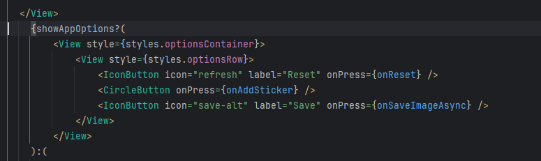
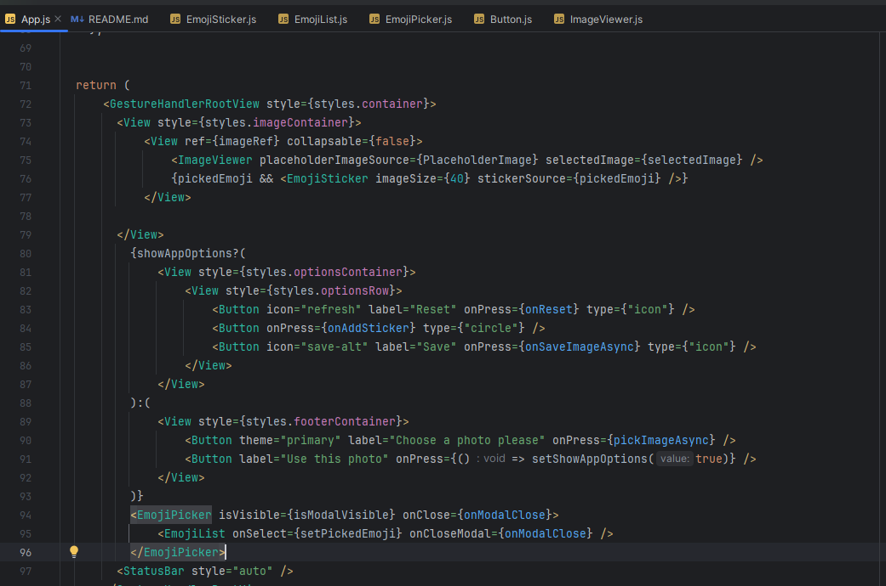

<h1>INFORME</h1>

<h4>Introduccion</h4>

La refactorizacion de codigo, en terminos muy extremistas puede aplicarse siempre, incluso en los codigos realizados por
las personas con la mayor experiencia, llevarlo al extremo puede lograr que el codigo sea mas rapido, pero tambien implica,
que se imposible de interprestar por otros desarrolladores e incluso por el mismo creador.  
La correcta refactorizacion hace al codigo mas legible y evita que su rendimiento empeore, de hecho lo mejora

<h4>Refactorizacion del Codigo</h4>

En mi codigo lo que se realizo fue un ordenamiento de los componentes de los botones, ya que existian 3, que aunque tenian ligeras
diferencias, cumplian funciones muy similares, por lo cual junte estos botones en uno solo.

<h3>¿Qué problemas específicos de rendimiento o mantenibilidad se identificaron en la aplicación original?</h3>

En la mantenibilidad, existen demasiados botones que su nivel de complejidad no es alto, por lo tanto no es necesarios crear 3 botones distintos.

<h3>¿Cómo se aseguró que el refactoring no afectara negativamente la funcionalidad existente?</h3>

Se agrego parametros descriptivos para indicar que tipo de boton se desea renderizar, esto no quita inferencia en el codigo

<h3>¿Qué mejoras de rendimiento y mantenibilidad se lograron con el refactoring?</h3>

Mejor mantenibilidad del codigo, menos componentes logran la misma resolucion

<h3>¿Cuáles fueron los desafíos más significativos durante el proceso de refactoring y cómo se superaron?</h3>

Entender que hace cada cosa porque usa librerias que desconozco

<h3>¿Qué impacto tuvo el refactoring en la experiencia del usuario final?</h3>

Ligera Cargas mas Rapida pero nada significativ

<h3>¿Cómo se podrían aplicar las lecciones aprendidas en este proyecto a futuros proyectos de desarrollo y refactoring?</h3>

A saber como juntar varios componentes en uno solo si se dan las condiciones

Antes: 

Despues: 
